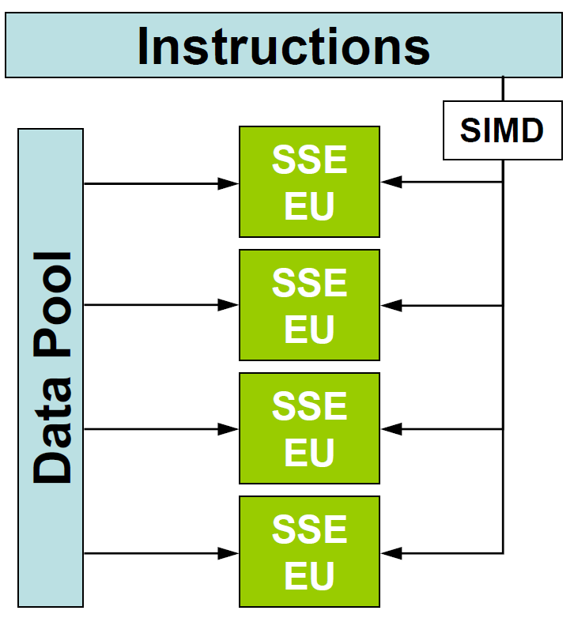
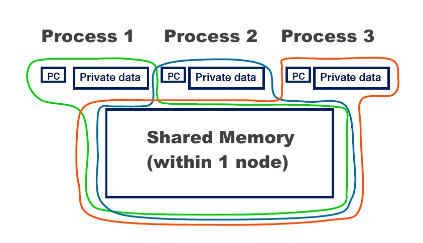
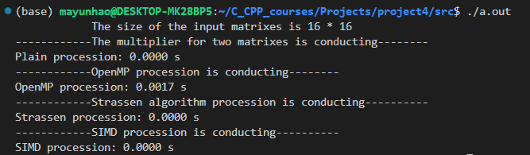
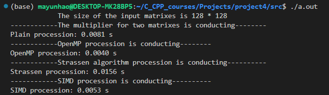
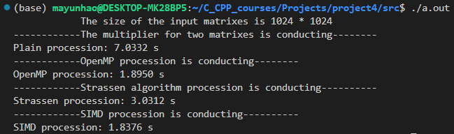
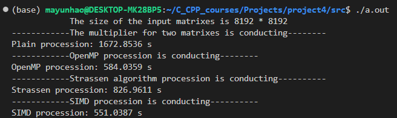
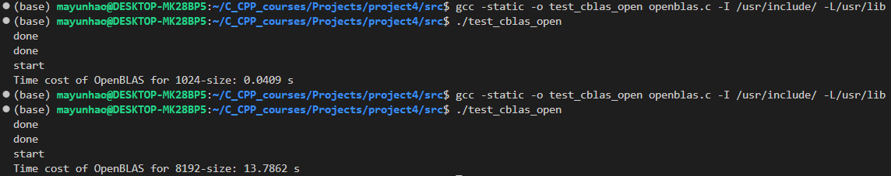

# **CS205 C/ C++ Program Design - Project 4**

**Name: Yunhao Ma**

**SID: 11911523**

# **Part 1 - Analysis** and Key Code
This project is a improvement for project 3. In this project, the improvement of multiply processing is implemented in several methods, which are **plain multiply**, **multiply with OpenMP**, **multiply with SIMD**(single instruction multiple data), **Strassen multiply ** and standard **OpenBLAS**. What should be noticed is that the use of `size_t` is very important to show a right size of certain matrix.

**1. Plain Multiply**

The multiply is more like simple multiply conducting value by value, following the basic rule for matrix multiply. The key code is shown as follows.

```c
//a straightforward way
Matrix * matmul_plain(const  Matrix * mat1,const  Matrix * mat2){//many original loops
    if (mat1->cols!=mat2->rows)
    {
        prsize_tf("The column of the first matrix or the row of the second matrix is not the same!\n");
        return NULL;
    }
    Matrix * mat_mul = createMatrix(mat1->rows,mat2->cols,NULL);
    for (size_t i = 0; i < mat1->rows; i++)
    {
        for (size_t j = 0; j < mat2->cols; j++)
        {
            float sum = 0;
            for (size_t x = 0; x < mat1->cols; x++)
            {
                sum += mat1->pData[i][x]*mat2->pData[x][j];
            }
            mat_mul->pData[i][j] = sum;
        }
    }
    return mat_mul;
}
```

**2. Multiply Using SIMD**

The so-called SIMD (Single Instruction Multiple Data stream) is short for single instruction multiple data, which can be understood as a set of instructions that can simultaneously operate multiple data and store it in a large register. The following figure better demonstrates the working principle of SIMD.

<br>

In my code, `aligned_alloc()` is used to ensure the address of values are aligned whenever users want to visit several values. Based on the lab8, I convert the 2D matrix size_to **1D**, where the `data1, data2, data3` are defined as the one dimensional matrix, to ensure that the parameter of function `_mm256_load_ps()` is in right data type `float *`. Moreover, the concept **registers** are used in the method. To be more specific, `a, b, c` are declared as `__m256` registers to hold adjacent eight values size_to one array. In this case, `_mm256_load_ps()` and   `_mm256_add_ps()` and `_mm256_mul_ps` can be used for registers. In the end, `_mm256_store_ps` is used to put the calculated value size_to a correct address for `mat_mul`. What should be paid enough attention is the address of every posize_ter must be aligned size_to 32 bytes. The corresponding key code is shown as the following. **Never forget to release the memory after using ** `aligned_alloc()`.

```c
//SIMD
Matrix * matmul_improved_SIMD(const  Matrix * mat1,const  Matrix * mat2){//many original loops
    if (mat1->cols!=mat2->rows)
    {
        prsize_tf("The column of the first matrix or the row of the second matrix is not the same!\n");
        return NULL;
    }
    __m256 a, b;
    __m256 c = _mm256_setzero_ps();
    // try to convert from 2D to 1D
    float * data1 = (float *)aligned_alloc(32,mat1->rows*mat1->cols*sizeof(float));
    float * data2 = (float *)aligned_alloc(32,mat2->rows*mat2->cols*sizeof(float));
    float * data3 = (float *)aligned_alloc(32,mat1->rows * mat2->cols*sizeof(float));
    for (size_t i = 0; i < mat1->rows; i++)
    {
        for (size_t j = 0; j < mat1->cols; j++)
        {
            data1[i*mat1->rows+j] = mat1->pData[i][j];
        }
    }
    for (size_t i = 0; i < mat2->rows; i++)
    {
        for (size_t j = 0; j < mat2->cols; j++)
        {
            data2[i*mat1->rows+j] = mat2->pData[i][j];
        }
    }
    float * data2_new = (float *)aligned_alloc(32, mat2->rows * mat2->cols * sizeof(float));
    for (size_t i = 0; i < mat2->rows * mat2->cols; i++)
    {
      *(data2_new + i) = *(data2 + (i / mat2->rows) + (i % mat2->rows) * mat2->cols);
    }
    float * data3_new = (float *)aligned_alloc(32, mat1->rows * mat2->cols * sizeof(float));
    //tag
    for (size_t i = 0; i < mat1->rows*mat2->cols; i++)
    {
        for (size_t j = 0; j < mat1->cols; j+=8)
        {   
        
            a = _mm256_load_ps(data1+(i / mat1->cols) * mat1->cols + j);
            b = _mm256_load_ps(data2_new+(i % mat2->cols) * mat2->rows+j);
            c =  _mm256_add_ps(c, _mm256_mul_ps(a, b));
            _mm256_store_ps(data3, c);
        }

        for (size_t x = 0; x < 8; x++)
        {
            *(data3_new + i) += *(data3 + x);
        }
        
    }
    // data 3 is the matmul in the end
    Matrix * mat_mul = createMatrix(mat1->rows,mat2->cols,NULL);
    for (size_t i = 0; i < mat1->rows; i++)
    {
        for (size_t j = 0; j < mat2->cols; j++)
        {
            mat_mul->pData[i][j] = data3_new[i*mat1->rows+j];
        }
        
    }
    free(data1);
    free(data2);
    free(data3);
    free(data2_new);
    free(data3_new);
    return mat_mul;
}
```

**3. Multiply Using OpenMP**

OpenMP adopts fork-join (fork-merge) parallel execution mode. When a thread encounters a parallel structure, it creates a thread group composed of itself and some other threads. Threads that encounter the parallel structure are referred to as the main thread in the thread group, and other threads are referred to as the group's slave threads.

<br>

In my code, the simplest way is to use `omp_set_num_threads()` and `#pragma omp parallel for` before doing the loops. In this case, different threads can be used simultaneously to do the task. For instance,  thread 1 may do the loop from `j = 0 ` to `j = 200`, and thread 2 may do the loop from `j = 201 ` to `j = 400`. The key code is shown as the following.

```c
//OpenMP
Matrix *  matmul_improved_omp(const  Matrix * mat1,const  Matrix * mat2){
    if (mat1->cols!=mat2->rows)
    {
        prsize_tf("The column of the first matrix or the row of the second matrix is not the same!\n");
        return NULL;
    }
    if (mat1->rows <= 8)
    {
        return matmul_plain(mat1, mat2);
    }
    Matrix * mat_mul = createMatrix(mat1->rows,mat2->cols,NULL);
    omp_set_num_threads(16);
    #pragma omp parallel for
    for (size_t i = 0; i < mat1->rows; i++)
    {
        for (size_t j = 0; j < mat2->cols; j++)
        {
            float sum = 0;
            for (size_t x = 0; x < mat1->cols; x++)
            {
                sum += mat1->pData[i][x]*mat2->pData[x][j];
            }
            mat_mul->pData[i][j] = sum;
        }
    }
    return mat_mul;
}
```

**4. Multiply Using Strassen Algorithm**

As for another algorithm, Strassen is quite famous in matrix multiplying. The algorithm can be shown like this. For formula C = A * B, every original matrix can be divided size_to four parts, displayed as:
$$
A = \left[
 \begin{matrix}
   A_{11} & A_{12} \\
   A_{21} & A_{22} 
  \end{matrix}
  \right] \tag{1}
$$

$$
B =\begin{bmatrix}
   B_{11} & B_{12}  \\
   B_{21} & B_{22}
  \end{bmatrix} \tag{2}
$$

$$
\begin{aligned}
S_1&=B_{12}-B_{22} \\ 
S_2&=A_{11}+A_{12} \\
S_3&=A_{21}+A_{22} \\
S_4&=B_{21}-B_{11} \\
S_5&=A_{11}+A_{22} \\
S_6&=B_{11}+B_{22} \\
S_7&=A_{12}-A_{22} \\
S_8&=B_{21}+B_{22} \\
S_9&=A_{21}-A_{11} \\
S_{10}&=B_{11}+B_{12} \\
\end{aligned}\tag{3}
$$

After this, users should compute 7 matrices.
$$
\begin{aligned}
P_1&=A_{11}\cdot S_1\\ 
P_2&=B_{22}\cdot S_2\\ 
P_3&=B_{11}\cdot S_3\\ 
P_4&=A_{22}\cdot S_4\\
P_5&=S_5\cdot S_6\\
P_6&=S_7\cdot S_8\\ 
P_7&=S_9\cdot S_{10}\\
\end{aligned}\tag{4}
$$
Thus, users can compute C according to:
$$
\begin{aligned}
C_{11}&=P_5+P_4-P_2+P_6 \\
C_{12}&=P_1+P_2\\
C_{21}&=P_3+P_4\\
C_{22}&=P_5+P_1-P_3-P_7
\end{aligned}\tag{5}
$$
There matrix C can be achieved at last. The corresponding code is shown as the following.

```c
//Strassen
Matrix *  matmul_improved_strassen(const  Matrix * mat1, const  Matrix * mat2){
    if (mat1->cols!=mat2->rows)
    {
        prsize_tf("The column of the first matrix or the row of the second matrix is not the same!\n");
        return NULL;
    }
    if (mat1->rows<=128)
    {
        return matmul_plain(mat1,mat2);
    }
    Matrix *S[10];
    for (size_t i = 0; i < 10; i++) {
        S[i] = createMatrix(mat1->rows/2, mat1->cols/2,NULL);
    }
    Matrix *P[7];
    for (size_t i = 0; i < 7; i++) {
        P[i] = createMatrix(mat1->rows/2, mat1->cols/2,NULL);
    }
    
    Matrix *A11, *A12, *A21, *A22;
    Matrix *B11, *B12, *B21, *B22;
    Matrix *C11, *C12, *C21, *C22;
    A11 = createMatrix(mat1->rows / 2, mat1->cols / 2,NULL);
    A12 = createMatrix(mat1->rows / 2, mat1->cols / 2,NULL);
    A21 = createMatrix(mat1->rows / 2, mat1->cols / 2,NULL);
    A22 = createMatrix(mat1->rows / 2, mat1->cols / 2,NULL);
    B11 = createMatrix(mat2->rows / 2, mat2->cols / 2,NULL);
    B12 = createMatrix(mat2->rows / 2, mat2->cols / 2,NULL);
    B21 = createMatrix(mat2->rows / 2, mat2->cols / 2,NULL);
    B22 = createMatrix(mat2->rows / 2, mat2->cols / 2,NULL);
    C11 = createMatrix(mat1->rows / 2, mat2->cols / 2,NULL);
    C12 = createMatrix(mat1->rows / 2, mat2->cols / 2,NULL);
    C21 = createMatrix(mat1->rows / 2, mat2->cols / 2,NULL);
    C22 = createMatrix(mat1->rows / 2, mat2->cols / 2,NULL);
    //value assignment for block
    for (size_t i = 0; i <mat1->rows / 2 ; i++)
    {
        for (size_t j = 0; j <mat1->cols / 2 ; j++)
        {   
            A11->pData[i][j] = mat1->pData[i][j];
        }
    }
    for (size_t i = 0; i <mat1->rows / 2 ; i++)
    {
        for (size_t j = mat1->cols/2; j <mat1->cols ; j++)
        {
            A12->pData[i][j-mat1->cols/2] = mat1->pData[i][j];
        }
    }
    for (size_t i = mat1->rows / 2; i <mat1->rows; i++)
    {
        for (size_t j = 0; j <mat1->cols/2 ; j++)
        {
            A21->pData[i-mat1->rows/2][j] = mat1->pData[i][j];
        }
    }
    for (size_t i = mat1->rows / 2; i <mat1->rows; i++)
    {
        for (size_t j = mat1->cols/2; j <mat1->cols ; j++)
        {
            A21->pData[i-mat1->rows/2][j-mat1->cols/2] = mat1->pData[i][j];
        }
    }
    for (size_t i = 0; i <mat2->rows / 2 ; i++)
    {
        for (size_t j = 0; j <mat2->cols / 2 ; j++)
        {   
            B11->pData[i][j] = mat2->pData[i][j];
        }
    }
    for (size_t i = 0; i <mat2->rows / 2 ; i++)
    {
        for (size_t j = mat2->cols/2; j <mat2->cols ; j++)
        {
            B12->pData[i][j-mat2->cols/2] = mat2->pData[i][j];
        }
    }
    for (size_t i = mat2->rows / 2; i <mat2->rows; i++)
    {
        for (size_t j = 0; j <mat2->cols/2 ; j++)
        {
            B21->pData[i-mat2->rows/2][j] = mat2->pData[i][j];
        }
    }
    for (size_t i = mat2->rows / 2; i <mat2->rows; i++)
    {
        for (size_t j = mat2->cols/2; j <mat2->cols ; j++)
        {
            B21->pData[i-mat2->rows/2][j-mat2->cols/2] = mat2->pData[i][j];
        }
    }
    S[0] = subtractMatrix(B12,B22);
    S[1] = addMatrix(A11,A12);
    S[2] = addMatrix(A21,A22);
    S[3] = subtractMatrix(B21,B11);
    S[4] = addMatrix(A11,A22);
    S[5] = addMatrix(B11,B12);
    S[6] = subtractMatrix(A12,A22);
    S[7] = addMatrix(B21,B22);
    S[8] = subtractMatrix(A11,A21);
    S[9] = addMatrix(B11,B12);

    P[0] = matmul_improved_strassen(A11,S[0]);
    P[1] = matmul_improved_strassen(S[1],B22);
    P[2] = matmul_improved_strassen(S[2],B11);
    P[3] = matmul_improved_strassen(A22,S[3]);
    P[4] = matmul_improved_strassen(S[4],S[5]);
    P[5] = matmul_improved_strassen(S[6],S[7]);
    P[6] = matmul_improved_strassen(S[8],S[9]);

    C11 = addMatrix(subtractMatrix(addMatrix(P[4],P[3]),P[1]),P[5]);
    C12 = addMatrix(P[0],P[1]);
    C21 = addMatrix(P[2],P[3]);
    C22 = subtractMatrix(subtractMatrix(addMatrix(P[4],P[0]),P[2]),P[6]);

    //give the value back to C matrix
    Matrix * mat_mul = createMatrix(mat1->rows,mat2->cols,NULL);
    for (size_t i = 0; i < mat1->rows; i++)
    {
        for (size_t j = 0; j < mat2->cols; j++)
        {
            if  (i<mat1->rows/2&j<mat2->cols/2){
                mat_mul->pData[i][j] = C11->pData[i][j];
            }
            else if (i<mat1->rows/2&j>=mat2->cols/2)
            {
                mat_mul->pData[i][j] = C12->pData[i][j-mat2->cols/2];
            }
            else if (i>=mat1->rows/2&j<mat2->cols/2)
            {
                mat_mul->pData[i][j] = C21->pData[i-mat1->rows/2][j];
            }
            else if (i>=mat1->rows/2&j>=mat2->cols/2)
            {
                mat_mul->pData[i][j] = C22->pData[i-mat1->rows/2][j-mat2->rows/2];
            }
        }
    }
    return mat_mul;
}
```

**5. Multiply Using OpenBLAS**

BLAS is a standard for mathematical calculation libraries and defines a set of APIs for matrix array operations. OpenBLAS is an optimized BLAS library based on GotoBLAS2 1.13 BSD version. In this case, `#include <cblas.h>` is used if using **OpenBLAS**. Time is recored by size_troducing `#include <sys/time.h>`. Several professional methods are used, like `cblas_sgemm()`. The testing code of this is shown as the following. The matrix formula calculated by `cblas_sgemm` is: **C=alpha*A*B+beta*C**, where A, B and C are all matrices, and C can be initially stored with biased values. The use of `cblas_sgemm(layout, transA, transB, M, N, K, alpha, A, LDA, B, LDB, beta, C, LDC)` matters, where `trans` means the matrix transpose, `M N K` means the size of matrices after transpose.

```c
#include <stdio.h>
#include <stdlib.h>
#include <cblas.h>
#include <sys/time.h>

#define parameter 8192

int main() {
    CBLAS_ORDER Order = CblasRowMajor;
    CBLAS_TRANSPOSE TransA = CblasNoTrans;
    CBLAS_TRANSPOSE TransB = CblasNoTrans;
    const float alpha = 1;
    const float beta = 0;
    float *m1 = (float *) malloc(sizeof(float *) * (parameter*parameter));
    float *m2 = (float *) malloc(sizeof(float *) * (parameter*parameter));
    float *m3 = (float *) malloc(sizeof(float *) * (parameter*parameter));
    FILE *fpa;
    if ((fpa = fopen("mat-A-8192.txt", "r")) == NULL) {
        printf("fail\n");
        exit(0);
    } else
        printf("done\n");
    float a;
    for (int i = 0; i <parameter; i++) {
        for (int j = 0; j <parameter; j++) {
            fscanf(fpa, "%f,", &a);
            m1[i * parameter+ j] = a;
        }
    }
    fclose(fpa);

    FILE *fpb;
    if ((fpb = fopen("mat-B-8192.txt", "r")) == NULL) {
        printf("fail\n");
        exit(0);
    } else
        printf("done\n");
    float b;
    for (int i = 0; i <parameter; i++) {
        for (int j = 0; j <parameter; j++) {
            fscanf(fpb, "%f,", &b);
            m2[i * parameter+ j] = b;
        }
    }
    fclose(fpb);
    struct timeval start, end;
    gettimeofday(&start, NULL);
    printf("start\n");
    cblas_sgemm(Order, TransA, TransB,parameter,parameter,parameter, alpha, m1,parameter, m2,parameter, beta, m3,parameter);
    cblas_sgemm(Order, TransA, TransB,parameter,parameter,parameter, alpha, m1,parameter, m2,parameter, beta, m3,parameter);
    cblas_sgemm(Order, TransA, TransB,parameter,parameter,parameter, alpha, m1,parameter, m2,parameter, beta, m3,parameter);
    cblas_sgemm(Order, TransA, TransB,parameter,parameter,parameter, alpha, m1,parameter, m2,parameter, beta, m3,parameter);
    cblas_sgemm(Order, TransA, TransB,parameter,parameter,parameter, alpha, m1,parameter, m2,parameter, beta, m3,parameter);
    gettimeofday(&end, NULL);
    int timeuse =1000000 * (end.tv_sec - start.tv_sec) + end.tv_usec - start.tv_usec;
    printf("Time cost of OpenBLAS for %d-size: %.4f s\n", parameter, ((float) timeuse / (5 * 1000000.0f)));
    return 0;
}
```


# **Part 2 - Verifications and Results**
Test case 1: **Matrix size: 16*16**<br>
<br>Test case 2: **Matrix size: 128*128**<br>
<br>Test case 3: **Matrix size: 1024*1024**<br>
<br>Test case 4: **Matrix size: 8K*8K**<br>
<br>

However, my computer cannot support the calculation of size of **64K**, which is too big for my personal computer. 

Test case 5: **OpenBLAS Testing**<br><br>

# **Part 3 - Challenges and Solutions**

1. During this project, I improve the quality of my code based on project 3. For instance, the `size_t` is highly used to replace `int` to show the data type of each matrix. There are also methods convert 2D array into 1D array. However, I still encounter lots of difficulties, but gain lots of experience. First of all, since the constrain of language C is highly required in this project, there are some differences should be noticed. In C++, the initialization of a memory can use `new` to declare a new space for memory use. However, in C, in I have to spend some time learning the difference characteristics of C and C++, where `malloc()` is used to allocate the memory. In the multiply in SIMD, I use the `aligned_alloc()` to make sure the address is aligned so that the system will not meet a segmentation fault. After using that, `free()` are needed to release memory space, which is very important. 
1. Secondly, the use of pointer is quite essential in coding. The pointer points at  a special address of each data type, making it possible to store data in very large amount. However, in `deleteMatrix` I find it very difficult. In the end, I make the argument to be reference to clear the memory by correct address. In a word, the pointer is very useful and charming. I should learn how to use it better in the future.
1. Moreover, I meet many difficulties using `OpenMP`  and `OpenBLAS`. For `OpenMP`, at first I use `time.c` where the `clock()` is used to record time. But the time is mismatched because there are caches for other parameters, which will make the procession time longer. Thus, I use `sys/time.h` to record the time, after which the `OpenMP` works well. When using that, users should add the condition `-mfma` to ensure the correct working situation. On the other hand, for `OpenBLAs`, it is very hard to install and use. Thanks to the website [走进向量计算：从源码编译 OpenBLAS - 知乎 (zhihu.com)](https://zhuanlan.zhihu.com/p/539369065), I can finally use the library to compare my work with that. When using that, I find the used time of `OpenBLAS` is much faster than my entire algorithm. It really works so fast! It is worthy recording the command in the terminal `gcc -static -o test_cblas_open test_cblas_dgemm.c -I /usr/include/ -L/usr/lib -lopenblas -lpthread -lgfortran` for `OpenBLAS`.
1. For all the require  sizes of matrices, my PC can not hold the size of **64K*64K**, even cannot build such matrix. It seems that I need to improve my PC when the semester finishes.
1. Last, the use of `GDB`is quite good in debugging. During the project, simply use `printf()` to display the information I want can hardly use because there are many segmentation fault where the display information cannot be shown. Thus, the use of `GDB` is necessary, like some basic orders `b (break)`, `r (run)`, `n (next)`, `p (print)` and so on, which can show the parameters in the coding. The `GDB` helps me a lot when I meet several bugs.
1. Thank you sincerely for reading my report. I am looking forward to the next project.
